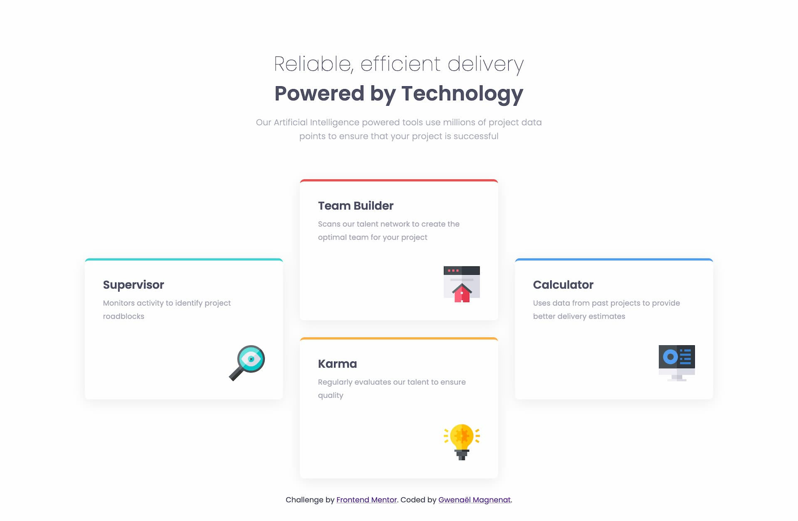

# Frontend Mentor - Four card feature section solution

This is a solution to the [Four card feature section challenge on Frontend Mentor](https://www.frontendmentor.io/challenges/four-card-feature-section-weK1eFYK). Frontend Mentor challenges help you improve your coding skills by building realistic projects.

## Table of contents

- [Overview](#overview)
  - [The challenge](#the-challenge)
  - [Screenshot](#screenshot)
  - [Links](#links)
- [My process](#my-process)
  - [Built with](#built-with)
  - [What I learned](#what-i-learned)
  - [Continued development](#continued-development)
  - [Useful resources](#useful-resources)
- [Author](#author)
- [Acknowledgments](#acknowledgments)

**Note: Delete this note and update the table of contents based on what sections you keep.**

## Overview

### The challenge

Users should be able to:

- View the optimal layout for the site depending on their device's screen size

### Screenshot



### Links

- Solution URL: [Add solution URL here](https://your-solution-url.com)
- Live Site URL: [Add live site URL here](https://your-live-site-url.com)

## My process

- Organising files for my workflow with scss
- Building a little tool to organise files faster
- Inspecting the figma file and setting up variables for colors
- Building the mobile version
- Adding breakpoint for the desktop layout
- Adding variant for sizes and spacing for the desktop layout
- Double checking all values and converting to rem when needed

### Built with

- Semantic HTML5 markup
- SCSS
- Flexbox
- CSS Grid
- Mobile-first workflow

### What I learned

I created a small script to organise my project files for my workflow. Running the script will do the following :

- move files in a src directory
- init an empty package.json file
- add a .prettierrc file with the `{}` content
- add node_modules in the .gitignore file
- init the git repository
- create empty scss partials files
- generate a dummy screenshot.jpg

```bash
# add the setup file to the .gitignore
echo "setup.sh" >> .gitignore

# Add a prettier config file
touch .prettierrc
echo "{}" >> .prettierrc

# Add a dummy screenshot file
touch screenshot.jpg

# Create source directory and move files
mkdir src
mv index.html src/
mv images src/

# Create scss directory and prepare partials
mkdir src/scss
cd src/scss
touch main.scss _variables.scss _mixins.scss _resets.scss

# Delete content of the main.scss file and add partials - ONLY BEFORE WORKING ON THE PROJECT
> main.scss
echo "@use 'variables' as *;" >> main.scss
echo "@use 'mixins' as *;" >> main.scss
echo "@use 'resets' as *;" >> main.scss
cd ../..

# Add empty packages.json
npm init -y

# Init empty git repository
git init

# Install packages - UPDATE package.json FILE WITH THE BOILERPLATE
npm install
```

I also refreshed my knowledge on CSS Grids. By analysing the project it looks like 3 columns on desktop so it can be easy to just wrap the center card in a div and use `flexbox`.
I didn't like this solution and wanted to use only CSS grid for the layout of the cards.

I started sketching the grid on a paper to plan what I wanted to do. I did a grid of 3 columns and 4 rows that will allow me to place the card appropriately.

I used `grid-column` and `grid-row` to set start and end value for each of the cards.

I used a custom attribute for the cards to differentiate them.

### Continued development

Learn more about grids and scss. Some part of the code seem to be repetitive and could be refactored in mixins or function.

Improve the configuration file with tests to avoid deleting important content in files

Learn to write a cli tool and a node package

### Useful resources

- [Interactive guide to grid](https://www.joshwcomeau.com/css/interactive-guide-to-grid/) - this helped me refresh my knowledge on grids

## Author

- Website - [Gwenaël Magnenat](https://gmagnenat.com)
- Frontend Mentor - [@gmagnenat](https://www.frontendmentor.io/profile/gmagnenat)
- LinkedIn - [@gmagnenat](https://www.linkedin.com/in/gmagnenat)
